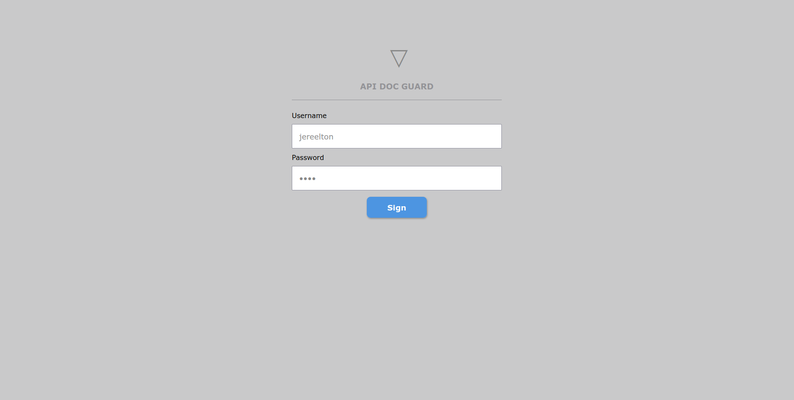
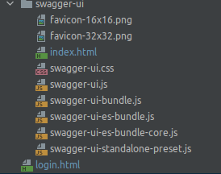
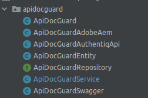

# API DOC GUARD DEMO
Project Description

# Application Integrity Identify

> MD5-File (jar): 00000000000000000000000000000000000000

# Resources

* Java 8 (jdk-1.8-212)
* Maven Project
* Spring Boot 2.0.1.RELEASE

# Dependencies

* Lombok
* Spring Data JPA
* Mysql Driver
* Log4j2
* Spring Rest Docs
* Spring Web
* Rest Repositories
* Rest Template (Client)
* Swagger (OpenAPI 3)
* Thymeleaf
* Crypto/MD5

# Environment Details
<pre>
- Linux Ubuntu 20.04 LTS

JDK
$ javac -version
javac 11.0.13

JRE
$ java -version
openjdk version "11.0.13" 2021-10-19
OpenJDK Runtime Environment (build 11.0.13+8-Ubuntu-0ubuntu1.20.04)
OpenJDK 64-Bit Server VM (build 11.0.13+8-Ubuntu-0ubuntu1.20.04, mixed mode, sharing)
</pre>

<pre>
- Windows 10 PRO

################
# JAVA 8 (1.8)
################

INSTALLERS
jdk-8u212-windows-x64.exe
jre1.8.0_212-windows-x64.exe (automatic download by jdk)

JDK
$ javac -version
javac 1.8.0_212

JRE
$ java -version
java version "1.8.0_212"
Java(TM) SE Runtime Environment (build 1.8.0_212-b10)
Java HotSpot(TM) 64-Bit Server VM (build 25.212-b10, mixed mode)

--------------------------------------------------------------------------------------------------

</pre>

---------------------------------------------------------------------------------------------------

# Maven Commands (jar generate)

1. mvn package
2. mvn clean compile assembly:single
3. mvn clean
4. mvn clean install
5. mvn clean package spring-boot:repackage

---------------------------------------------------------------------------------------------------

# OpenAPI

> The openAPI with Swagger-UI is available to query and help understand the application by REST API

* http://localhost:31303/swagger-ui/protector

---------------------------------------------------------------------------------------------------

# How to use

> pom.xml (dependencies)

<code>

    <!--DATABASE-->
    <dependency>
        <groupId>org.springframework.boot</groupId>
        <artifactId>spring-boot-starter-data-jpa</artifactId>
    </dependency>
    <dependency>
        <groupId>mysql</groupId>
        <artifactId>mysql-connector-java</artifactId>
        <scope>runtime</scope>
    </dependency>
    
    <!--DOC-->
    <dependency>
        <groupId>org.springdoc</groupId>
        <artifactId>springdoc-openapi-ui</artifactId>
        <version>1.6.4</version>
    </dependency>
    <dependency><!--NEEDED TO USE IN API DOC GUARD-->
        <groupId>org.springframework.boot</groupId>
        <artifactId>spring-boot-starter-thymeleaf</artifactId>
    </dependency>
    <dependency><!--NEEDED TO USE BCRYPT IN API DOC GUARD-->
        <groupId>org.springframework.security</groupId>
        <artifactId>spring-security-crypto</artifactId>
        <version>5.6.1</version>
    </dependency>

</code>

> application.properties

<pre>
## SWAGGER
#----------------------------------------------------------------------------------------------------
# See more: https://springdoc.org/properties.html
springdoc.swagger-ui.enabled=true
springdoc.swagger-ui.path=/swagger-ui-test.html
springdoc.swagger-ui.operationsSorter=method

#StandaloneLayout, BaseLayout
springdoc.swagger-ui.layout=StandaloneLayout
#/api-docs, api-docs-guard, /api-docs-custom
springdoc.api-docs.path=/api-docs-guard
#true, false
springdoc.model-and-view-allowed=true

## API GUARD DOC
#----------------------------------------------------------------------------------------------------
#true, false
apidocguard.enable=true
#localhost, 192.168.15.14, app.domain.com
apidocguard.server-name=192.168.15.14
#swagger, adobe, authentiq
apidocguard.type=swagger
#md5, bcrypt
apidocguard.data.crypt.type=md5
#true, false
apidocguard.url.show=true
#Secrect
apidocguard.secret=9ba8c91f-cacf-41d2-be8d-e8d1bc844a96
</pre>

> src/main/resources/templates

* Get these file from official GitHub account swagger-ui

> index.html (custom file)

<pre>
Use the current file index.html contained in this project, replace the original swagger index.html
</pre>

> src/main/java/com/domain/project-name

---------------------------------------------------------------------------------------------------

# Tests

